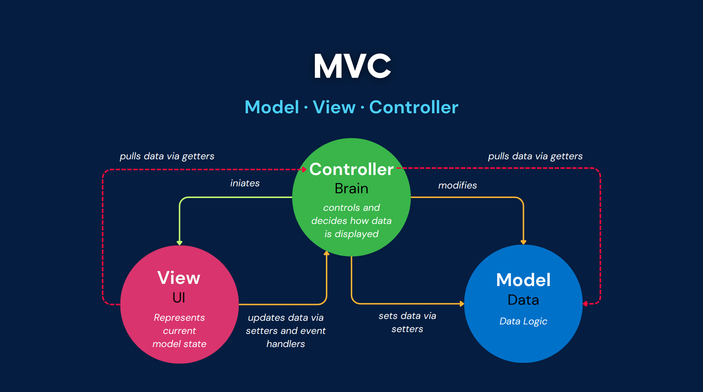
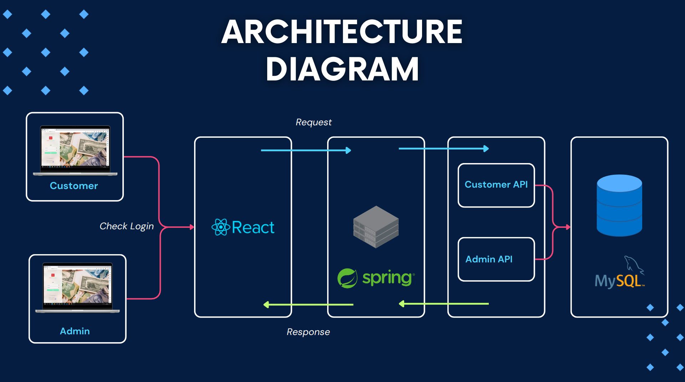

# OnlineBankingSystem

Online banking is a system that allows customers of a bank or other financial institution to conduct a range of financial transactions through the financial institution's website or mobile app.

Developed using Spring Boot and react, offering wide range of features:

-   User Registration & Login
-   Account Overview
-   Account Statement
-   Fund Transfer
-   Deposits And Withdrawal
-   Transaction history
-   Admin Dashboard

## Deployment

This project is deployed on amazon EC2 instance: [Project Link](ec2-107-20-53-146.compute-1.amazonaws.com:3000)

[Presentation Link](https://www.canva.com/design/DAFswtChkpY/Hqjp-K7aNZTCo0d-F4dOqQ/view?utm_content=DAFswtChkpY&utm_campaign=designshare&utm_medium=link&utm_source=publishsharelink)

## Architecture





## Installation

1. Clone Repository

```
git clone https://github.com/predator4hack/OnlineBankingSystem.git
cd OnlineBankingSystem
```

2. Configure Database (Follow [these](https://www.digitalocean.com/community/tutorials/how-to-install-mysql-on-ubuntu-20-04) steps to install MySQL) and update the datasource url in application.properties (/backend/src/main/resources) with localhost ip

```
sudo start mysql.service
mysql
create database bankdb;
```

3. Run the application

```
cd backend
java -jar /target/Banking-0.0.1-SNAPSHOT.jar
cd ..
cd frontend
npm install
npm start
```

## Future Enhancements

-   Multi-Currency Support - Enable transactions in multiple currencies.
-   Investment Management - Integrate features for managing investments, stocks, and portfolios.
-   Enhanced Reporting - Provide detailed financial reports and analytics.
-   Chat Support - Implement a chatbot for customer support.
-   Integration with Third-Party Services - Explore partnerships for additional services like insurance, loans, etc.
